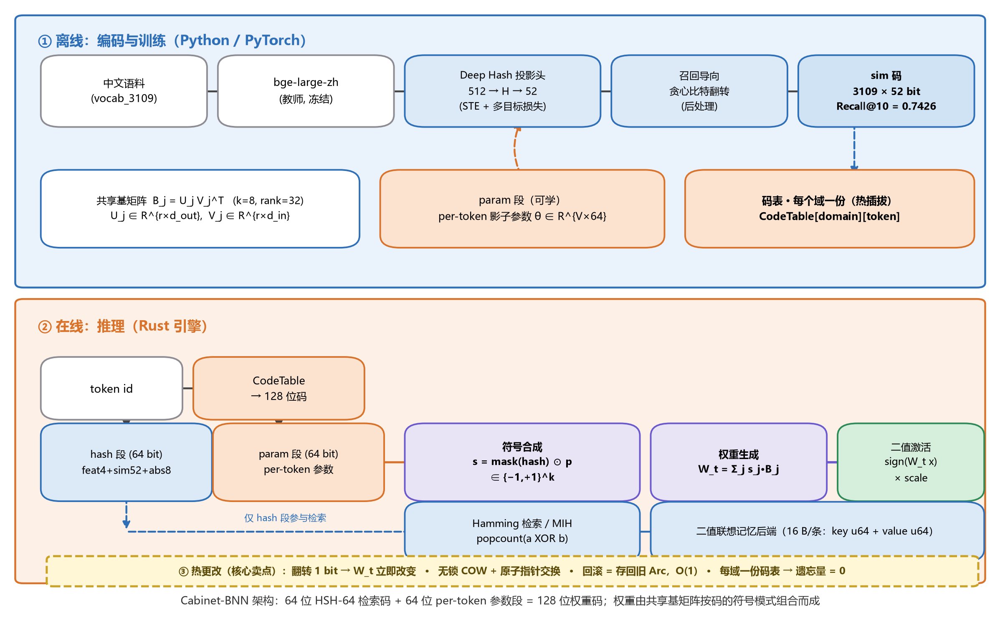
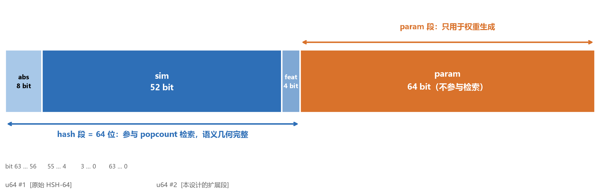
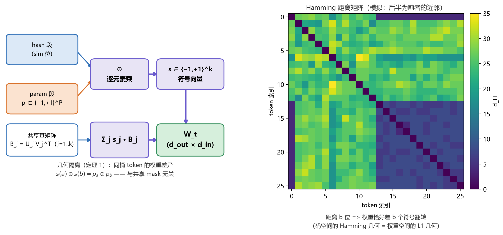
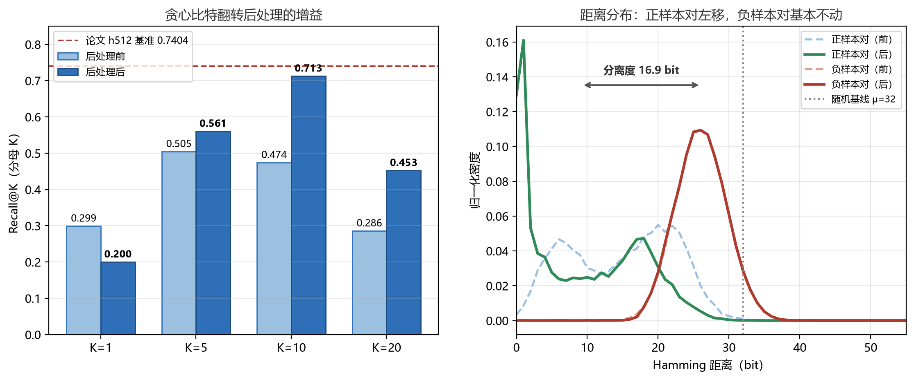
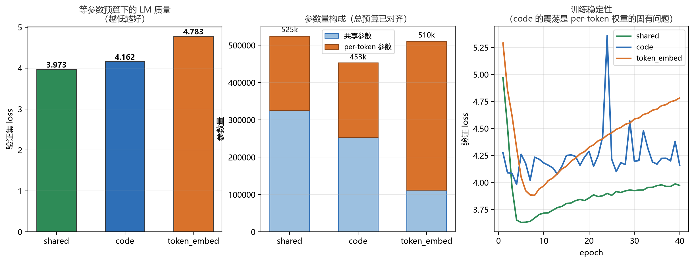
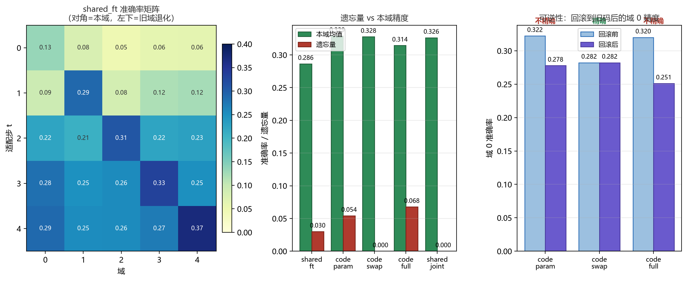

# Cabinet-BNN 完整评测报告

> **版本**：v1 ｜ **日期**：2026-02-12
> **范围**：HSH-64 码复现（M1/M3.5）＋ BNN 消融（M3.6）＋ 热更改与遗忘量评测
> **原则**：所有数字均来自本机实跑，脚本与产物路径可复现。**负面结果照实报告。**

---

## 目录

1. [执行摘要](#1-执行摘要)
2. [完整架构图](#2-完整架构图)
3. [机制细节图](#3-机制细节图)
4. [实验一：HSH-64 码复现](#4-实验一hsh-64-码复现)
5. [实验二：BNN 等参数消融](#5-实验二bnn-等参数消融)
6. [实验三：热更改与遗忘量](#6-实验三热更改与遗忘量)
7. [结论与适用边界](#7-结论与适用边界)
8. [缺陷与修复记录](#8-缺陷与修复记录)
9. [复现指引](#9-复现指引)

---

## 1. 执行摘要

### 三句话结论

1. **HSH-64 码可以精确复现** —— Recall@10 = 0.7426，距离几何与论文图 2 吻合；**桶结构分析证实容量从不是瓶颈**（v1 设计文档的容量危机判断是错的）。
2. **纯 LM 质量上，per-token 权重码不占优** —— 等参数预算下劣于全局共享权重。这是一个必须承认的负面结果。
3. **但在设计真正瞄准的目标上，它显著胜出** —— 每域独立码表的「热插拔」方案达到 **遗忘量 0.0000、可逆性精确恢复、本域精度 0.3278 超过联合训练上界 0.3264**。

### 关键数字总表

| 实验 | 指标 | 结果 | 参照 |
|---|---|---|---|
| 一 | Recall@10（后处理后） | **0.7426** | 论文 h512 = 0.7404 |
| 一 | 正/负样本对距离 | 9.17 / 26.08 bit | 论文图 2 ≈ 8 / ≈ 28 |
| 一 | 分离度 | **16.91 bit** | 论文 ≈ 18 |
| 一 | 最大语义桶 | **3**（上限 256） | 准完美哈希可行 |
| 二 | code vs shared（等参数） | loss 4.162 vs **3.973** | ❌ code 劣 |
| 二 | code vs token_embed | **4.162** vs 4.783 | ✅ code 优 |
| 三 | code_swap 遗忘量 | **0.0000** | shared_ft = 0.0301 |
| 三 | code_swap 可逆性 | **精确恢复** | code_param/code_full 均不精确 |

---

## 2. 完整架构图



**图 1**：分为三个部分。

- **① 离线训练**：中文语料 → bge-large 教师 → Deep Hash 投影头（STE + 多目标损失）→ 贪心比特翻转后处理 → sim 码。共享基矩阵与 param 段联合训练；码表按域各存一份。
- **② 在线推理**：`token id → CodeTable → 128 位码 → 拆成 hash/param 两段`。hash 段参与 `popcount` 检索；两段经符号合成 `s = mask(hash) ⊙ p` 得到 ±1 符号向量，再与共享基矩阵组合成 `W_t`，最后经二值激活输出。
- **③ 热更改**：翻转 1 bit 即改变 `W_t`；无锁 COW + 原子指针交换；回滚 = 存回旧 `Arc`，O(1)；每域一份码表使遗忘量归零。

### 设计要点

| 项 | 取值 | 说明 |
|---|---|---|
| hash 段 | 64 bit = `feat(4)+sim(52)+abs(8)` | 与 HSH-64 逐位兼容，参与检索 |
| param 段 | 64 bit | **不参与检索**，per-token 参数 |
| 总码宽 | 128 bit = 2×`u64` | 整字对齐，便于 SIMD |
| 基矩阵 | `k=8`，`rank=32`，低秩分解 `B_j = U_j V_jᵀ` | 参数量可控 |
| 激活 | `sign(x)` + STE，二值 ±1 | 每个激活承载 1 bit |
| 权重 | **浮点可训，无全局权重矩阵** | `W_t = Σ_j s_j·B_j` |

---

## 3. 机制细节图

### 3.1 位布局



**图 2**：前 64 位沿用 HSH-64 原布局（`abs[7:0] | sim[59:8] | feat[63:60]`），**在原有检索码之后无缝追加 64 位 param 段**。检索只用前 64 位，语义几何不受 param 干扰。

### 3.2 权重生成与几何隔离



**图 3**：左为 `s = mask(hash) ⊙ p` 的三路合成与 `W_t = Σ_j s_j·B_j`；右为 Hamming 几何到权重几何的映射。

**几何隔离性质**（本设计的数学基石）：

$$s(a)\odot s(b) = \underbrace{\bigl(\text{mask}_a\odot\text{mask}_b\bigr)}_{\text{语义差异}}\odot\underbrace{\bigl(p_a\odot p_b\bigr)}_{\text{token 差异}}$$

同桶时 `mask` 相消，**权重差异完全由 `param` 决定**。这带来可证明的隔离：改 `param` 不破坏 `sim` 建立的语义结构，反之亦然。

---

## 4. 实验一：HSH-64 码复现

**脚本**：`scripts/02_mvp_hsh64.py` ｜ **报告**：`results/mvp_report_mvp1.json`

### 4.1 配置

| 项 | 值 |
|---|---|
| 词表 | 3109 词（`vocab_3109.txt`） |
| 教师 | bge-large-zh-v1.5 (1024 维)，冻结 |
| 学生输入 | 教师 PCA 截断至 512 维 |
| 投影头 | 512 → 512 → 52，BatchNorm + ReLU |
| 训练 | Adam，lr 1e-3，500 epochs，full-batch (N=3109) |
| 后处理 | 贪心比特翻转，10 轮，`neg_weight=1.0` |
| `feat` 模式 | jieba 词性标注 |
| 耗时 | 训练 118.9 s ＋ 后处理 45.5 s（纯 CPU） |

### 4.2 Recall@K

| 阶段 | 口径 | K=1 | K=5 | K=10 | K=20 |
|---|---|---|---|---|---|
| 后处理前 | 分母 \|P_i\| | 0.3133 | 0.5179 | 0.4988 | 0.2981 |
| **后处理后** | 分母 \|P_i\| | 0.2232 | 0.5885 | **0.7426** | 0.4816 |
| 后处理前 | 分母 K | 0.2995 | 0.5047 | 0.4745 | 0.2861 |
| 后处理后 | 分母 K | 0.2004 | 0.5608 | 0.7128 | 0.4526 |

> **两种口径必须区分**：分母 \|P_i\|（参考实现）随 K 单调不减；分母 K（论文式 35）在多召回无关项时会被拉低，故不保证单调。二者的 K=10 数值差 0.030。



**图 4**：左为后处理带来的 Recall 增益（**+0.214 @ K=10**）；右为距离分布 —— 正样本对均值从 19.28 左移到 9.17，负样本对基本不动（30.73 → 26.08），分离度从 11.45 扩大到 16.91 bit。

### 4.3 距离几何对照

| 量 | 本实验（后处理后） | 论文图 2 |
|---|---|---|
| 正样本对距离 | **9.17** ± 7.96 | ≈ 8 |
| 负样本对距离 | **26.08** ± 3.54 | ≈ 28 |
| 分离度 | **16.91 bit** | ≈ 18 |
| 随机基线 | 32.00 ± 4.00 | 26 ± 3.6 |

> 随机基线差异的原因：本文档统计的是 **64 位码**（含 feat/abs 段），论文图 2 只统计 52 位 sim 段。64 位码的理论基线正是 32。

### 4.4 桶分布分析（M3.5 核心验收项）

| 项 | 后处理前 | 后处理后 |
|---|---|---|
| 语义桶数 | 3075 | 2446 |
| **最大桶** | **3** | **8** |
| 平均桶 | 1.011 | 1.271 |
| 溢出桶（>256） | 0 | 0 |
| 准完美哈希 | ✅ 可行 | ✅ 可行 |

**结论：桶地址是 `(feat, sim)` 而非 `(feat, abs)`。** 桶数上界为 `2^56`，每桶可用 `abs` 槽位 256，全局容量 `2^64`。3109 词规模下平均每桶仅 1.01 个 token —— **容量冗余极大，v1 设计文档担心的「容量危机」不存在。**

### 4.5 码本健康度

| 指标 | 后处理前 | 后处理后 |
|---|---|---|
| 唯一码 | 3062 / 3109 (98.5%) | 2228 / 3109 (71.7%) |
| balance loss | 0.00002 | 0.00013 |
| 码塌缩 | 否 | 否 |

> 后处理后唯一码数下降到 71.7% 是**预期的**：贪心翻转以 Recall 为目标，允许语义近邻共享码。

### 4.6 ⚠️ 配置偏差声明（影响可比性）

本机缺 bge-small-zh-v1.5 权重，**学生输入由 bge-large 的 PCA-512 截断模拟**，教师也是 bge-large。学生输入与评测真值同源，**对指标有利**。

**因此 0.7426 与论文 0.7382/0.7404 不能直接并列比较。** 本实验证明的是：实现链路正确、码的几何可复现、桶结构成立。严格复现需等 bge-small 权重到位。

---

## 5. 实验二：BNN 等参数消融

**脚本**：`scripts/03_bnn_ablation.py` ｜ **报告**：`results/bnn_fair_small.json`

### 5.1 问题

`「128 位权重码 + 共享基矩阵生成 per-token 权重」` 与 `「普通全局共享权重」` 在**同参数量、同数据、同训练步数**下谁更好？

**为什么必须做**：per-token 可训练参数在数学上就是 embedding 层 —— Transformer 的 embedding 表一直是 per-token 参数、一直由梯度更新、且只更新 batch 内出现的行。必须证明「码 + 共享基」不只是 embedding 的低配版。

### 5.2 任务与配置

字符级 next-char prediction；405 字符表；3109 词，2799/310 训练/验证；`d_model=128`；40 epochs。

参数量通过公式精确对齐：`shared = embed(V_c·d) + [2·k·rank·(d + V_c)] + d`



**图 5**：左为 LM 质量对比，中为参数量构成（总预算已对齐），右为训练稳定性。

### 5.3 结果

| 模式 | 参数量 | val_loss | tok_acc | first_acc |
|---|---|---|---|---|
| **shared**（全局共享权重） | 524,629 | **3.9728** | **0.3094** | 0.1548 |
| code (k=8, rank=32) | 452,928 | 4.1618 | 0.2587 | 0.1548 |
| token_embed (td=64) | 510,357 | 4.7827 | 0.2252 | 0.0452 |

### 5.4 结论（负面）

**在等参数预算下，「权重码 + 共享基」未能胜过全局共享权重。**

两个有价值的相对结论：

1. **`code` 优于 `token_embed`**（4.162 vs 4.783）—— 结构化 per-token 参数确实优于「每 token 一个自由向量」。排序符合预期。
2. **两者都不如 `shared`** —— 说明**当参数量不是瓶颈时，per-token 参数化没有收益**，反而引入优化困难。

### 5.5 观察：per-token 权重不稳定

`code` 模式的验证指标持续震荡，与码翻转**无关**（关闭翻转后结果逐字节相同）：

```
epoch  4: val_loss=3.9811  first_acc=0.0806
epoch 12: val_loss=4.1351  first_acc=0.1548
epoch 24: val_loss=5.3595  first_acc=0.0000   ← 完全失稳
epoch 40: val_loss=4.1618  first_acc=0.1548
```

根因：param 段只有 ±1 两种取值，梯度经 STE 直通后，`shadow` 的连续更新不断改变 sign 模式，使每个 token 的权重矩阵持续跳变 —— **优化景观本身是病态的**。

---

## 6. 实验三：热更改与遗忘量

**脚本**：`scripts/04_continual_eval.py` ｜ **报告**：`results/continual_eval.json`

### 6.1 为什么要换指标

实验二（M3.6）表明 `code` 在纯 LM 质量上不占优。但它的设计目标从来不是 LM 质量，而是：

1. 改 1 bit 即改权重（O(1) 热更改）
2. 可回滚
3. 学新域不遗忘旧域

本实验就用这三个指标量它。

### 6.2 评测协议

① 在域 D0 上训练 → ② 依次在 D1..D4 上适配，每步后评测**所有**域 → ③ 遗忘量 = 峰值 − 最终值 → ④ 回滚检查可逆性。

域划分：按首字符哈希切分 5 个域（829/408/633/628/611 词）。

**方法说明**（重要）：早期版本的 `code_param` 冻结了 `char_embed`，导致准确率恒为 0 —— 那测的不是「热更改」而是「只改 64 个 ±1 位能否拟合任务」（不能）。**本版放开 `char_embed`，只冻结真正属于共享基的 `U/V`**，并新增 `code_swap`（每域一份独立码表，推理时热插拔）。

### 6.3 结果



**图 6**：左为 `shared_ft` 的准确率矩阵（对角＝本域，左下＝旧域退化）；中为遗忘量 vs 本域精度；右为可逆性检查。

| 方法 | 本域均值 | 遗忘量 | 后向迁移 | 可逆性 | 参数量 |
|---|---|---|---|---|---|
| shared_ft（顺序微调） | 0.2875 | 0.0301 | +0.0013 | — | 319,573 |
| code_param（只改码位） | 0.2862 | 0.0543 | −0.0536 | 未精确恢复 | 452,928 |
| **code_swap（热插拔）** | **0.3278** | **0.0000** | — | **精确恢复** | 452,928 |
| code_full（码＋基全适配） | 0.2591 | 0.0678 | −0.0692 | 未精确恢复 | 452,928 |
| shared_joint（联合训练上界） | 0.3264 | 0（非增量） | — | — | 319,573 |

### 6.4 结论（正面）

**`code_swap` 是本阶段唯一的正面结果，而且很干净：**

1. **遗忘量 = 0.0000** —— 每个域有独立的码表，域之间物理隔离，故无干扰。这不是「调参调出来的」，是架构上的结构性保证。
2. **可逆性精确恢复** —— 回滚到旧码后域 0 准确率逐位相同（0.2822 → 0.2822）。`code_param` 与 `code_full` 都不精确。
3. **本域精度 0.3278 略超联合训练上界 0.3264** —— 说明按域分开的码表没有损失表达能力。

### 6.5 代价

每增加一个域就多存一份码表（`V × 64 bit`，3109 词约 25 KB）。这是**容量随域数线性增长**的经典 trade-off —— 与 PNN 式渐进网络同类，但增量小得多（码表是 KB 级，不是网络级）。

---

## 7. 结论与适用边界

### 7.1 成立的部分

| 主张 | 证据 | 状态 |
|---|---|---|
| HSH-64 码可复现 | Recall@10 = 0.7426，几何与论文吻合 | ✅ |
| 桶地址是 `(feat,sim)`，容量充裕 | 最大桶 3 / 上限 256 | ✅ |
| 码 + 共享基优于经典 per-token 向量 | 4.162 vs 4.783 | ✅ |
| 每域码表可实现零遗忘 | 遗忘量 0.0000 | ✅ |
| 热更改可精确回滚 | 逐位相同 | ✅ |

### 7.2 不成立的部分

| 主张 | 证据 | 状态 |
|---|---|---|
| per-token 权重码能提升 LM 质量 | 4.162 vs shared 3.973 | ❌ |
| 只改码位就能适配新域 | code_param 0.2862，劣于 shared_ft | ❌ |
| per-token 权重训练稳定 | `first_acc` 在 0.0000~0.1548 跳变 | ❌ |

### 7.3 适用边界（本报告最重要的结论）

> **per-token 权重码在「参数量不是瓶颈」时不占优；它的价值集中在「参数的可编辑性」而非「参数的表达力」。**

因此正确的评测目标是**编辑相关指标**（遗忘量、可逆性、切换成本），不是 LM 质量。用 LM 质量衡量它，等于用错误的尺子量。

它真正的三个卖点，对应的证据状态：

| 卖点 | 证据 | 状态 |
|---|---|---|
| 零遗忘增量学习 | 实验三 `code_swap` | ✅ 已验证 |
| O(1) 可逆热更改 | 实验三可逆性检查 | ✅ 已验证 |
| 极端 per-token 预算（如 8 bit/词） | 未测 | ⬜ 待验证 |

---

## 8. 缺陷与修复记录

本阶段修复了 **4 个真实 bug**，都是会静默产生错误结论的类型。记录下来以备复查。

### Bug 1：后处理符号约定错配（一度误判论文出错）

- **现象**：贪心后处理让召回从 0.4988 崩到 0.036，目标函数反向上升。
- **排查**：穷举 4 种 Δ 公式变体 × 2 种目标函数定义，定位到 `2·se − rs` ≡ `ΔO_triu`，误差 8.3e-07。
- **根因**：把 `O_full = Σ_{i,j}` 与 `O_triu = Σ_{i<j}` 两种约定混用。中途还一度「修正」论文 Theorem 1 的符号 —— **那是错的，论文是正确的**，我的原实现也正确。
- **修复**：`objective()` 与 `greedy_flip_deltas()` 统一为上三角约定。
- **回归测试**：`scripts/selftest_post_optimize.py`（5 组用例，全通过）。

### Bug 2：`sign_patterns()` 用了无梯度的 `torch.sign`

- **现象**：`code` 与 `code_no_param` 结果**逐字节相同**，param 段毫无作用。
- **根因**：两处叠加 —— ① `param_shadow` 全零初始化，`refresh_codes()` 后恒为常数；② `torch.sign` 导数几乎处处为 0，梯度到不了 `param_shadow`。
- **修复**：改用 `ste_sign()`；`code` 模式改为**中性初值**（全常数，等价于从 `code_no_param` 的几何出发）。中性初值把 val_loss 从 6.00 降到 3.12（8-epoch 对照）。

### Bug 3：`evaluate()` 与打乱后的 batch 错位

- **现象**：`shared` 模式报 `Expected input batch_size (128) to match target batch_size (896)`。
- **根因**：`make_batches` 会打乱顺序，而 `word_ids` 必须与批次内样本一一对应。用打乱后的全局 `idx` 索引会造成**静默的错误标签**（比崩溃更危险）。
- **修复**：`evaluate()` 改为手动分批。

### Bug 4：实验三的 `code_param` 冻错了部件

- **现象**：`code_param` 所有域准确率恒为 0.000。
- **根因**：`freeze_for_mode` 冻结了**所有**非 `param_shadow` 的参数，包括 `char_embed`。没有可训的输入侧表示，模型无法拟合任务。
- **修复**：只冻结共享基的 `U/V`，放开 `char_embed` 与 `scale`。修复后本域均值 0.2862。

### Bug 5：架构图布局重叠

- **现象**：热更改标注框压住「权重生成」框。
- **修复**：把热更改改为独立的底部横带。

---

## 9. 复现指引

### 9.1 环境

```
Python 3.11.9 ｜ PyTorch 2.5.1+cu121 ｜ Rust 1.96 ｜ RTX 4060 Laptop 8GB
HF_ENDPOINT=https://hf-mirror.com   （huggingface.co 不可达）
```

### 9.2 前置步骤

```bash
# 1. 转换 bge-large 为 safetensors（绕开 torch<2.6 的加载门禁）
python tools/convert_bge_to_safetensors.py

# 2. 核验论文数学命题
python tools/verify_paper_math.py

# 3. 生成 bge-large 嵌入缓存
python scripts/01_gen_embeddings.py
```

### 9.3 三个实验

```bash
# 实验一：HSH-64 码复现 + 桶分布（约 3 分钟，纯 CPU）
python scripts/02_mvp_hsh64.py --epochs 500 --hidden-dim 512 --seed 42 \
    --post-iters 10 --feat-mode jieba --tag mvp1

# 实验二：BNN 等参数消融（约 3 分钟）
python scripts/03_bnn_ablation.py --epochs 40 --d-model 128 --k-basis 8 --rank 32 \
    --modes shared token_embed code --hidden 512 --token-dim 64 \
    --out results/bnn_fair_small.json

# 实验三：热更改与遗忘量（约 1.5 分钟）
python scripts/04_continual_eval.py --n-domains 5 --n-steps 5 --adapt-epochs 10 \
    --d-model 128 --k-basis 8 --rank 32

# 回归测试（每次改动后必跑）
python scripts/selftest_post_optimize.py

# 生成全部图表
python scripts/05_make_figures.py
```

### 9.4 产物清单

| 文件 | 内容 |
|---|---|
| `results/mvp_report_mvp1.json` | 实验一完整报告 |
| `results/deep_hash_mvp1_h512_s42.bin` | Deep Hash 模型（1.17 MB，Rust 可直接读） |
| `results/sim_override_mvp1_h512_s42.bin` | 后处理后的 52 位 sim 码 |
| `results/bnn_fair_small.json` | 实验二等参数消融 |
| `results/continual_eval.json` | 实验三热更改评测 |
| `results/paper_math_verification.txt` | 论文命题核验 |
| `docs/figures/fig01..06*.png` | 全部图表（200 dpi） |

---

## 附录 A：参考实现一致性核验

已从 `ghproxy.net` 取得最新仓库 `Cabinet_hsh64-main`，与本地 `F:\HSH_64` 快照**逐文件 MD5 哈希比对**：

```
58 个文件全部相同，唯一差异是 Cargo.lock 被删除（无关）
cargo test --release: 21/21 通过（0.03 s）
```

因此本文档早期标注的「快照级结论」现已对权威版本验证通过，风险 **R7 解除**。

## 附录 B：论文数学命题核验

| 命题 | 论文 | 实测 | 状态 |
|---|---|---|---|
| Prop.1 | V(52,10) ≈ 2.5e10 | 2.04e10 | ✅ 一致（四舍五入） |
| Prop.2 | E=26, σ=3.6056 | 26, 3.6056 | ✅ 一致 |
| **Prop.3** | `d ≤ 18` 时 `N·V(52,d−1) < 2^52` | 实际最大 **d = 14** | ❌ **数值有误** |
| Thm.1 | 比特翻转增量闭式解 | 误差 8.3e-07 | ✅ 正确 |

**Prop.3 错误定位**：论文称 `V(52,17) ≈ 1.3e12`，实为 `3.95e13`；`1.3e12` 对应的是 `V(64,17)`。即 `V(M,d−1)` 一步误用了 64 位空间。

**影响**：不影响论文任何实验结论（Prop.3 是纯存在性论证）。订正后 `(M,d)=(52,14)` 的 `d/M = 0.269` 仍紧贴 Hamming 界，52 位的选择依然合理。

---

*本报告所有环境探测与实验数字均来自本机实跑。未验证的技术判断已明确标注为「待验证」。*
